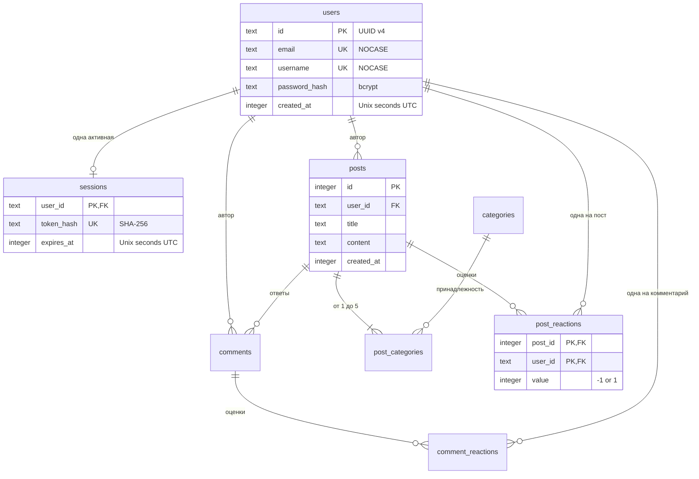

# Как устроен Discuss Hub

## Пять частей системы

| Часть | Простыми словами | Ответственность в коде |
| --- | --- | --- |
| `cmd/server` | Дверь открывается и закрывается | Конфигурация, запуск HTTP, аккуратная остановка |
| `handlers` | Приёмная | Маршруты, формы, проверки доступа, ответы и HTML |
| `auth` | Пропускная система | Пароли, идентификаторы, срок действия сессии |
| `db` | Картотека с правилами | Таблицы, связи, ограничения, транзакции |
| `insights` | Прозрачная сводка | Словарный анализ и статистика из SQL |

Приложение не хранит «текущего пользователя» в общей глобальной переменной. Каждый HTTP-запрос получает собственный `requestState` через `context.Context`. Общие структуры только читаются, защищены mutex (`limiter`) или предоставляют безопасную конкурентную работу (`database/sql`).

## Что происходит при создании поста

```mermaid
sequenceDiagram
    participant B as Браузер
    participant H as HTTP / handlers
    participant A as auth
    participant D as SQLite
    B->>H: POST /posts + cookie + csrf + поля
    H->>A: Проверить токен сессии
    A->>D: SELECT пользователя и действующей сессии
    D-->>A: Пользователь или отсутствие сессии
    A-->>H: Личность только для этого запроса
    H->>H: Доступ, Origin, CSRF, размер, лимит частоты
    H->>D: BEGIN; INSERT поста; INSERT категорий
    D->>D: Проверить внешние ключи и ограничения
    D-->>H: COMMIT или ошибка с ROLLBACK
    H-->>B: 303 на /posts/id или понятная ошибка
```

1. Middleware устанавливает защитные HTTP-заголовки и ограничивает время обработки.
2. Cookie содержит случайный UUID сессии. Его SHA-256 сравнивается с `sessions.token_hash`, и `expires_at` должен быть строго больше текущего времени.
3. `requireUser` запрещает запись без действующей сессии. ID автора берётся **только** из результата проверки; поле формы `user_id` ничего не меняет.
4. `form` принимает только ограниченные по размеру URL-encoded формы. Проверяет Origin, `Sec-Fetch-Site`, подписанный CSRF-токен и повторяющиеся скалярные поля.
5. `CreatePost` обрезает внешние пробелы, проверяет Unicode, длину и категории.
6. Пост и все связи с категориями сохраняются в одной транзакции. Если последняя категория не существует, первый INSERT тоже отменится.
7. После успеха HTTP 303 переводит браузер на GET. Обычное обновление страницы не повторяет POST.
8. `html/template` экранирует пользовательский текст при показе. `<script>` остаётся текстом.

## Сессия и CSRF — разные задачи

Сессия отвечает: **кто отправляет запрос?** CSRF-проверка отвечает: **пришла ли форма с нашего сайта в том же контексте сессии?**

- UUID v4 генерируется криптографически стойким источником. Сырой токен хранится только в cookie браузера.
- В таблице `sessions` поле `user_id` — первичный ключ. SQL upsert атомарно заменяет токен при новом входе. Даже два одновременных входа не создадут две строки.
- Logout удаляет строку по хешу **переданного токена**, а не просто по ID пользователя. Старый браузер поэтому не способен удалить новую сессию.
- Cookie: `HttpOnly`, `SameSite=Lax`, срок 24 часа. При HTTPS — дополнительно `Secure`, host-only и `__Host-`.
- CSRF-токен — случайное значение плюс HMAC от этого значения и токена сессии. Форме нужно передать тот же подписанный токен, что хранится в её cookie.
- После входа/выхода CSRF обновляется. При перезапуске сервера меняется ключ HMAC: уже открытые формы нужно обновить, но действующие сессии сохраняются в SQLite.
- Гостевые формы входа/регистрации тоже защищены от CSRF.
- Для отсутствующего email выполняется сравнение с фиктивным bcrypt-хешем; ответ всегда общий: email или пароль неверен.

## Схема данных



Полная исполняемая схема: [`internal/db/schema.sql`](../internal/db/schema.sql). Нижняя граница «хотя бы одна категория» обеспечивается в `CreatePost` транзакцией; внешние ключи и отсутствие повторных категорий обеспечиваются также SQLite.

База работает в WAL-режиме. Читатели не блокируют одного активного писателя. `busy_timeout=5000` даёт конкурирующим писателям ограниченное время ожидания. `synchronous=FULL` усиливает гарантии сохранения подтверждённой транзакции в рамках гарантий SQLite и файловой системы. Максимум 8 соединений.

## Почему лайк и дизлайк не могут существовать одновременно

Первичный ключ реакции — `(post_id, user_id)` или `(comment_id, user_id)`. В одной строке допустимо ровно одно значение: `1` или `-1`. Upsert заменяет существующее значение. Команда `0` удаляет строку, а не сохраняет третье состояние.

Повторный лайк идемпотентен: два одинаковых запроса оставляют один лайк. Это помогает при повторной отправке браузером или сетевой задержке.

## Как SQL не завышает статистику

Соединить посты сразу с комментариями, реакциями и категориями одним JOIN легко, но строки перемножатся. Например, два комментария × три реакции дадут шесть строк.

Поэтому:

- карточки считают комментарии и реакции независимыми индексированными подзапросами;
- активность пользователя предварительно агрегирует посты и комментарии в отдельных CTE;
- top posts соединяет только посты и реакции;
- наиболее активная категория считает только `post_categories`.

Запрос самой активной категории:

```sql
SELECT c.name, COUNT(*)
FROM post_categories pc
JOIN categories c ON c.id = pc.category_id
GROUP BY c.id
ORDER BY COUNT(*) DESC, c.name COLLATE NOCASE, c.id
LIMIT 1;
```

## Границы проекта

Это законченный форум в рамках предмета. Самостоятельно он не предоставляет сброс пароля по email, подтверждение email, модераторскую панель, загрузку файлов, rich text, полнотекстовый поиск или распределённую работу нескольких экземпляров. Они не требуются аудитом и не маскируются фиктивными кнопками.

`/insights` делает линейный проход по содержимому всех постов при каждом запросе, как требует ТЗ. Trending хранит частоты слов за сутки в памяти. Для небольшой учебной/командной площадки это разумно; для большой публичной сети потребуется отдельный дизайн аналитики, модерации и ограничения злоупотреблений.

## Вопросы для самостоятельной проверки понимания

Попробуйте сначала ответить без подсказки, затем сверьтесь с кодом:

1. Где берётся ID автора POST /posts и почему его нельзя подменить полем формы?
2. Какая строка SQL гарантирует единственную сессию и как работает logout старого браузера?
3. Почему `great great bad bad` — Neutral, а `not good` — Positive?
4. Чем `COUNT(*)` в запросе категории отличается от подсчёта постов в Go?
5. Что произойдёт, если одна из переданных категорий отсутствует?
6. Как отличить отсутствие сессии от отказа базы данных?
7. Почему уникальность email проверяется ограничением базы, а не только предварительным SELECT?
8. Что теряется при копировании только `forum.db`, пока приложение пишет в WAL?

Практическое упражнение: измените список sentiment-слов, сначала добавив тест. Затем проверьте влияние на статистику и объяснение на странице.
